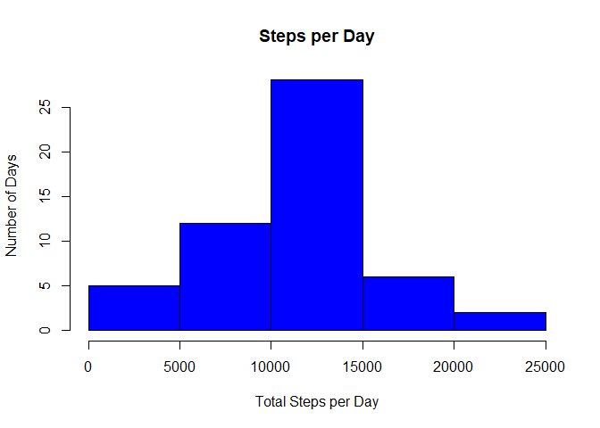
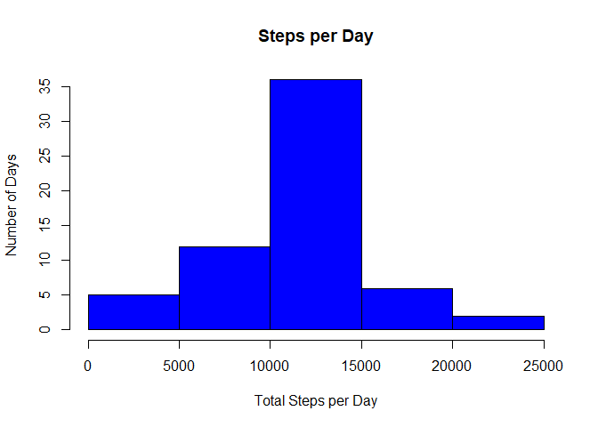
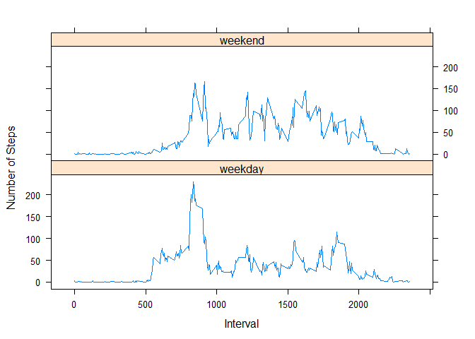

## Loading and preprocessing the data

This section covers the loading of the data and the preparation for future analysis.


Read in the `activity.csv` file that contains the raw data


```r
activity <- read.csv(file = "./activity.csv",header = TRUE,sep = ",")
```

Print out the first 6 rows of the loaded data and the Column Names.


```
##   steps       date interval
## 1    NA 2012-10-01        0
## 2    NA 2012-10-01        5
## 3    NA 2012-10-01       10
## 4    NA 2012-10-01       15
## 5    NA 2012-10-01       20
## 6    NA 2012-10-01       25
```

```
## [1] "steps"    "date"     "interval"
```

Convert the date column from a character vector to a date


```r
activity$date <- as.Date(x = activity$date,format = "%Y-%m-%d")
```

## What is mean total number of steps taken per day?

Calculation of the total number of steps taken per day and create a histogram


```r
steps <- aggregate(steps~date,activity,sum, na.rm = TRUE)
hist(steps$steps,main = "Steps per Day", xlab = "Total Steps per Day", ylab = "Number of Days", col = "blue")
```

<!-- -->

Calculate the Mean and Median Values


```
## [1] "Mean total steps taken per day: 10766.188679"
```

```
## [1] "Median total steps taken per day: 10765.000000"
```

## What is the average daily activity pattern?

A time series plot (i.e. type = "l") of the 5-minute interval (x-axis) and the average number of steps taken, averaged across all days (y-axis)


```r
avgactivity <- aggregate(steps~interval,activity,mean,na.rm = TRUE)
plot(x = avgactivity$interval,y = avgactivity$steps,type = "l",xlab = "5 Minute Interval", ylab = "Average Number of Steps",main = "Average Daily Activity Planner")
```

<!-- -->


Which 5-minute interval, on average across all the days in the dataset, contains the maximum number of steps?


```r
max.avgactivity <- avgactivity$interval[avgactivity$steps == max(avgactivity$steps)]
print(sprintf("5-min time Interval with maximum average steps taken per day: %i",max.avgactivity))
```

```
## [1] "5-min time Interval with maximum average steps taken per day: 835"
```


## Imputing missing values

Calculate and report the total number of missing values in the dataset


```r
na.count <- sum(!complete.cases(activity))
print(sprintf("NA Count for rows with missing data: %i", na.count))
```

```
## [1] "NA Count for rows with missing data: 2304"
```

Fill in the missing date using mean data for missing values and created a new dataset called `avgactivity`


```r
newactivity <- activity
sapply(unique(activity$interval),
       function(x)
         newactivity[!complete.cases(newactivity) & (newactivity$interval == x),1] <<- avgactivity$steps[avgactivity$interval == x])
```

```
##   [1]   1.7169811   0.3396226   0.1320755   0.1509434   0.0754717   2.0943396
##   [7]   0.5283019   0.8679245   0.0000000   1.4716981   0.3018868   0.1320755
##  [13]   0.3207547   0.6792453   0.1509434   0.3396226   0.0000000   1.1132075
##  [19]   1.8301887   0.1698113   0.1698113   0.3773585   0.2641509   0.0000000
##  [25]   0.0000000   0.0000000   1.1320755   0.0000000   0.0000000   0.1320755
##  [31]   0.0000000   0.2264151   0.0000000   0.0000000   1.5471698   0.9433962
##  [37]   0.0000000   0.0000000   0.0000000   0.0000000   0.2075472   0.6226415
##  [43]   1.6226415   0.5849057   0.4905660   0.0754717   0.0000000   0.0000000
##  [49]   1.1886792   0.9433962   2.5660377   0.0000000   0.3396226   0.3584906
##  [55]   4.1132075   0.6603774   3.4905660   0.8301887   3.1132075   1.1132075
##  [61]   0.0000000   1.5660377   3.0000000   2.2452830   3.3207547   2.9622642
##  [67]   2.0943396   6.0566038  16.0188679  18.3396226  39.4528302  44.4905660
##  [73]  31.4905660  49.2641509  53.7735849  63.4528302  49.9622642  47.0754717
##  [79]  52.1509434  39.3396226  44.0188679  44.1698113  37.3584906  49.0377358
##  [85]  43.8113208  44.3773585  50.5094340  54.5094340  49.9245283  50.9811321
##  [91]  55.6792453  44.3207547  52.2641509  69.5471698  57.8490566  56.1509434
##  [97]  73.3773585  68.2075472 129.4339623 157.5283019 171.1509434 155.3962264
## [103] 177.3018868 206.1698113 195.9245283 179.5660377 183.3962264 167.0188679
## [109] 143.4528302 124.0377358 109.1132075 108.1132075 103.7169811  95.9622642
## [115]  66.2075472  45.2264151  24.7924528  38.7547170  34.9811321  21.0566038
## [121]  40.5660377  26.9811321  42.4150943  52.6603774  38.9245283  50.7924528
## [127]  44.2830189  37.4150943  34.6981132  28.3396226  25.0943396  31.9433962
## [133]  31.3584906  29.6792453  21.3207547  25.5471698  28.3773585  26.4716981
## [139]  33.4339623  49.9811321  42.0377358  44.6037736  46.0377358  59.1886792
## [145]  63.8679245  87.6981132  94.8490566  92.7735849  63.3962264  50.1698113
## [151]  54.4716981  32.4150943  26.5283019  37.7358491  45.0566038  67.2830189
## [157]  42.3396226  39.8867925  43.2641509  40.9811321  46.2452830  56.4339623
## [163]  42.7547170  25.1320755  39.9622642  53.5471698  47.3207547  60.8113208
## [169]  55.7547170  51.9622642  43.5849057  48.6981132  35.4716981  37.5471698
## [175]  41.8490566  27.5094340  17.1132075  26.0754717  43.6226415  43.7735849
## [181]  30.0188679  36.0754717  35.4905660  38.8490566  45.9622642  47.7547170
## [187]  48.1320755  65.3207547  82.9056604  98.6603774 102.1132075  83.9622642
## [193]  62.1320755  64.1320755  74.5471698  63.1698113  56.9056604  59.7735849
## [199]  43.8679245  38.5660377  44.6603774  45.4528302  46.2075472  43.6792453
## [205]  46.6226415  56.3018868  50.7169811  61.2264151  72.7169811  78.9433962
## [211]  68.9433962  59.6603774  75.0943396  56.5094340  34.7735849  37.4528302
## [217]  40.6792453  58.0188679  74.6981132  85.3207547  59.2641509  67.7735849
## [223]  77.6981132  74.2452830  85.3396226  99.4528302  86.5849057  85.6037736
## [229]  84.8679245  77.8301887  58.0377358  53.3584906  36.3207547  20.7169811
## [235]  27.3962264  40.0188679  30.2075472  25.5471698  45.6603774  33.5283019
## [241]  19.6226415  19.0188679  19.3396226  33.3396226  26.8113208  21.1698113
## [247]  27.3018868  21.3396226  19.5471698  21.3207547  32.3018868  20.1509434
## [253]  15.9433962  17.2264151  23.4528302  19.2452830  12.4528302   8.0188679
## [259]  14.6603774  16.3018868   8.6792453   7.7924528   8.1320755   2.6226415
## [265]   1.4528302   3.6792453   4.8113208   8.5094340   7.0754717   8.6981132
## [271]   9.7547170   2.2075472   0.3207547   0.1132075   1.6037736   4.6037736
## [277]   3.3018868   2.8490566   0.0000000   0.8301887   0.9622642   1.5849057
## [283]   2.6037736   4.6981132   3.3018868   0.6415094   0.2264151   1.0754717
```

Calculation of the total number of steps taken per day and create a histogram


```r
newsteps <- aggregate(steps~date,newactivity,sum)
hist(newsteps$steps,main = "Steps per Day", xlab = "Total Steps per Day", ylab = "Number of Days", col = "blue")
```

<!-- -->

Calculate the Mean and Median Values


```
## [1] "Mean total steps taken per day: 10766.188679"
```

```
## [1] "Median total steps taken per day: 10766.188679"
```

## Are there differences in activity patterns between weekdays and weekends?


```r
newactivity$weekend <- "weekday"
newactivity$weekend[weekdays(newactivity$date) %in% c("Saturday", "Sunday")] <- "weekend"
newactivity$weekend <- as.factor(newactivity$weekend)
stepsbyday <- aggregate(steps~interval + weekend,data = newactivity,FUN = mean)
```

Make a panel plot containing a time series plot (i.e. type = "l") of the 5-minute interval (x-axis) and the average number of steps taken, averaged across all weekday days or weekend days (y-axis). See the README file in the GitHub repository to see an example of what this plot should look like using simulated data.


<!-- -->
